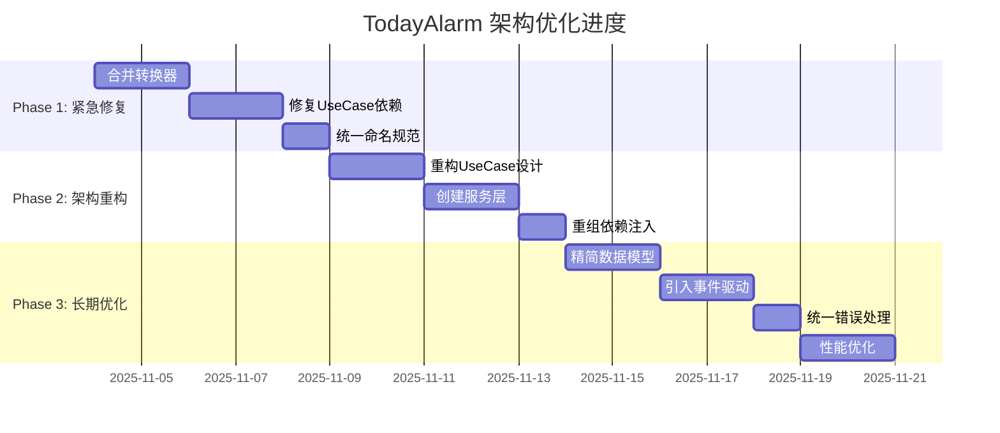

# TodayAlarm 架构优化路线图

## 🗺️ 总体规划

本文档提供了 TodayAlarm 项目架构优化的详细路线图，包括时间安排、里程碑和交付物，确保优化工作有序进行。

## 📅 时间规划

### 🚨 Phase 1: 紧急修复（第1周）

#### Day 1-2: 合并重复转换器
**时间**: 2天
**负责人**: Android开发工程师
**优先级**: P0

**任务分解**:
- Day 1上午: 分析现有转换器，设计统一方案
- Day 1下午: 创建新的 `DatabaseConverters.kt`
- Day 2上午: 迁移转换逻辑，更新数据库配置
- Day 2下午: 测试验证，删除旧文件

**交付物**:
- [ ] 统一的 `DatabaseConverters.kt`
- [ ] 更新的 `AppDatabase.kt`
- [ ] 删除的旧转换器文件
- [ ] 测试报告

#### Day 3-4: 修复UseCase依赖
**时间**: 2天
**负责人**: 架构师 + Android开发工程师
**优先级**: P0

**任务分解**:
- Day 3上午: 分析循环依赖，绘制依赖图
- Day 3下午: 设计 `TodoPlanCoordinator` 协调器
- Day 4上午: 实现协调器，重构UseCase依赖
- Day 4下午: 更新依赖注入，测试验证

**交付物**:
- [ ] `TodoPlanCoordinator.kt`
- [ ] 重构后的UseCase实现
- [ ] 更新的 `UseCaseModule.kt`
- [ ] 依赖关系图

#### Day 5: 统一命名规范
**时间**: 1天
**负责人**: Android开发工程师
**优先级**: P0

**任务分解**:
- 上午: 重命名所有带"New"后缀的UseCase
- 下午: 更新所有引用，测试验证

**交付物**:
- [ ] 重命名的UseCase文件
- [ ] 更新的引用
- [ ] 编译和测试报告

**🎯 Phase 1 里程碑**
- [ ] 所有重复代码已消除
- [ ] 循环依赖已解决
- [ ] 命名规范已统一
- [ ] 项目编译通过，测试通过

---

### 🏗️ Phase 2: 架构重构（第2周）

#### Day 1-2: 重构UseCase设计模式
**时间**: 2天
**负责人**: 架构师 + Android开发工程师
**优先级**: P1

**任务分解**:
- Day 1上午: 设计统一的UseCase接口
- Day 1下午: 创建核心接口和基类
- Day 2上午: 重构现有UseCase实现
- Day 2下午: 统一参数设计，测试验证

**交付物**:
- [ ] `CommandUseCase.kt`, `QueryUseCase.kt`, `FlowUseCase.kt`
- [ ] 重构后的所有UseCase实现
- [ ] 统一的参数设计模式
- [ ] 设计文档

#### Day 3-4: 创建服务层
**时间**: 2天
**负责人**: Android开发工程师
**优先级**: P1

**任务分解**:
- Day 3上午: 创建 `ValidationService`
- Day 3下午: 创建 `DataCleanupService`
- Day 4上午: 创建 `TodoCreationService`
- Day 4下午: 迁移逻辑，删除重复代码

**交付物**:
- [ ] `ValidationService.kt`
- [ ] `DataCleanupService.kt`
- [ ] `TodoCreationService.kt`
- [ ] 重构后的UseCase实现

#### Day 5: 重组依赖注入模块
**时间**: 1天
**负责人**: 架构师
**优先级**: P1

**任务分解**:
- 上午: 重组 `UseCaseModule`，创建 `ServiceModule`
- 下午: 重构 `ManagerModule`，测试验证

**交付物**:
- [ ] 重构后的 `UseCaseModule.kt`
- [ ] 新的 `ServiceModule.kt`
- [ ] 精简的 `ManagerModule.kt`
- [ ] 依赖注入文档

**🎯 Phase 2 里程碑**
- [ ] UseCase设计模式统一
- [ ] 服务层建立，重复代码消除
- [ ] 依赖注入模块化
- [ ] 架构清晰度显著提升

---

### 🚀 Phase 3: 长期优化（第3-4周）

#### Week 3: 精简数据模型 + 事件驱动
**时间**: 5天
**负责人**: 架构师 + Android开发工程师
**优先级**: P2

**Day 1-2: 精简数据模型**
- 分析字段使用情况，设计精简模型
- 创建数据库迁移，测试迁移过程

**Day 3-4: 引入事件驱动**
- 设计事件系统，实现事件发布器
- 重构UseCase交互，解耦依赖

**Day 5: 集成测试**
- 端到端测试，性能测试
- 文档更新

**交付物**:
- [ ] 精简的数据模型
- [ ] 事件驱动架构
- [ ] 数据库迁移脚本
- [ ] 性能测试报告

#### Week 4: 统一错误处理 + 性能优化
**时间**: 5天
**负责人**: Android开发工程师 + 测试工程师
**优先级**: P2

**Day 1-2: 统一错误处理**
- 创建全局错误处理器
- 重构ViewModel错误处理

**Day 3-4: 性能优化**
- 分析性能瓶颈，优化关键路径
- 内存优化，编译优化

**Day 5: 最终测试**
- 完整测试套件
- 性能基准测试
- 文档完善

**交付物**:
- [ ] 统一的错误处理系统
- [ ] 性能优化报告
- [ ] 完整测试报告
- [ ] 最终架构文档

**🎯 Phase 3 里程碑**
- [ ] 数据模型精简完成
- [ ] 事件驱动架构实现
- [ ] 错误处理统一
- [ ] 性能显著提升

---

## 📊 进度跟踪

### 关键指标

#### 代码质量指标
| 指标 | 当前值 | 目标值 | Phase 1 | Phase 2 | Phase 3 |
|------|--------|--------|---------|---------|---------|
| 重复代码率 | 25% | 5% | 20% | 10% | 5% |
| 圈复杂度 | 15 | 10 | 13 | 11 | 10 |
| 测试覆盖率 | 60% | 80% | 65% | 75% | 80% |
| 编译时间 | 3min | 2min | 2.5min | 2.2min | 2min |

#### 架构质量指标
| 指标 | 当前值 | 目标值 | Phase 1 | Phase 2 | Phase 3 |
|------|--------|--------|---------|---------|---------|
| 依赖复杂度 | 80% | 30% | 60% | 40% | 30% |
| 模块耦合度 | 50% | 30% | 45% | 35% | 30% |
| 接口一致性 | 60% | 100% | 80% | 95% | 100% |
| 文档完整性 | 70% | 90% | 75% | 85% | 90% |

### 进度仪表板

## 🎯 成功标准

### Phase 1 成功标准
- [ ] 项目编译时间 < 2.5分钟
- [ ] 零循环依赖警告
- [ ] 重复代码减少 20%
- [ ] 所有单元测试通过

### Phase 2 成功标准
- [ ] UseCase设计模式 100% 统一
- [ ] 服务层覆盖所有重复逻辑
- [ ] 依赖注入模块化完成
- [ ] 架构文档更新完成

### Phase 3 成功标准
- [ ] 数据模型字段减少 30%
- [ ] 事件驱动架构正常运行
- [ ] 错误处理 100% 统一
- [ ] 性能提升 10% 以上

## 🚨 风险管理

### 技术风险

#### 高风险
1. **数据库迁移失败**
   - 风险等级: 🔴 高
   - 影响: 数据丢失
   - 缓解措施: 完整备份 + 分步迁移 + 回滚方案

2. **循环依赖无法解决**
   - 风险等级: 🟡 中
   - 影响: 架构重构受阻
   - 缓解措施: 架构师评审 + 多种方案备选

#### 中风险
3. **性能回归**
   - 风险等级: 🟡 中
   - 影响: 用户体验下降
   - 缓解措施: 性能基准测试 + 持续监控

4. **测试覆盖不足**
   - 风险等级: 🟡 中
   - 影响: 质量风险
   - 缓解措施: 测试驱动开发 + 代码审查

### 项目风险

#### 进度风险
1. **延期风险**
   - 风险等级: 🟡 中
   - 影响: 项目延期
   - 缓解措施: 每日站会 + 进度跟踪 + 资源调配

2. **资源风险**
   - 风险等级: 🟢 低
   - 影响: 开发效率
   - 缓解措施: 跨职能团队 + 知识共享

## 📋 交付清单

### Phase 1 交付物
- [ ] 代码变更记录
- [ ] 测试报告
- [ ] 技术文档
- [ ] 依赖关系图

### Phase 2 交付物
- [ ] 架构设计文档
- [ ] 重构报告
- [ ] 性能基准
- [ ] 代码质量报告

### Phase 3 交付物
- [ ] 最终架构文档
- [ ] 性能优化报告
- [ ] 运维手册
- [ ] 知识库文档

## 🔄 持续改进

### 反馈机制
1. **每日站会**: 同步进度，识别阻塞
2. **周度回顾**: 总结经验，调整计划
3. **里程碑评审**: 评估质量，确认交付

### 质量保证
1. **代码审查**: 所有变更必须经过审查
2. **自动化测试**: CI/CD 管道验证
3. **性能监控**: 持续跟踪关键指标

---

**创建时间**: 2025-11-04
**版本**: v1.0
**维护者**: TodayAlarm 开发团队

这个路线图将指导团队有序完成 TodayAlarm 项目的架构优化工作，确保按时交付高质量的架构改进。